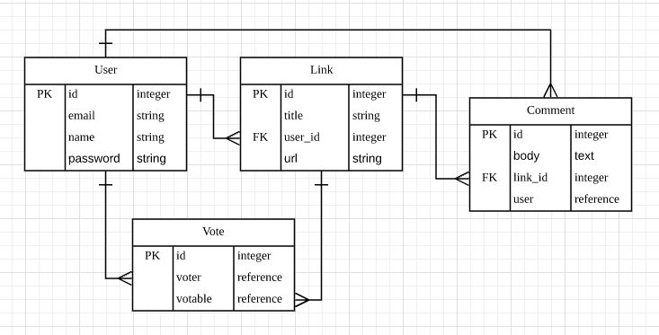
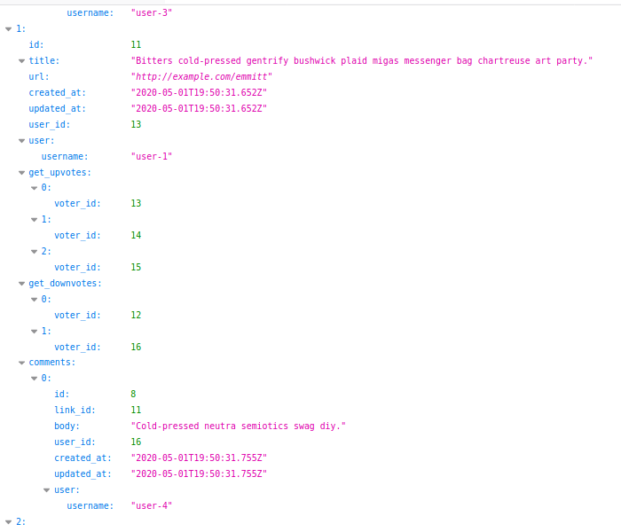
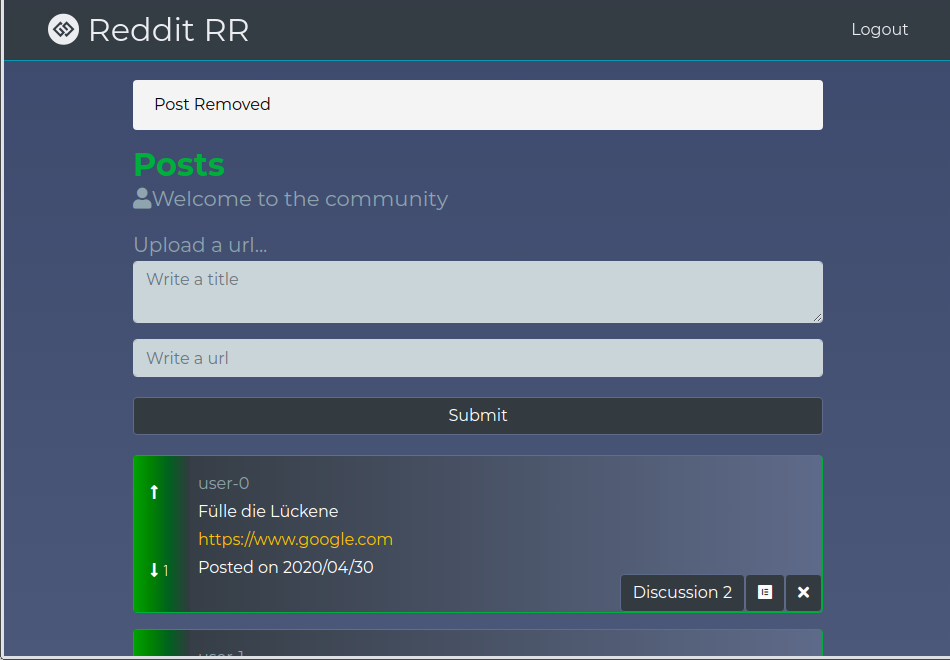
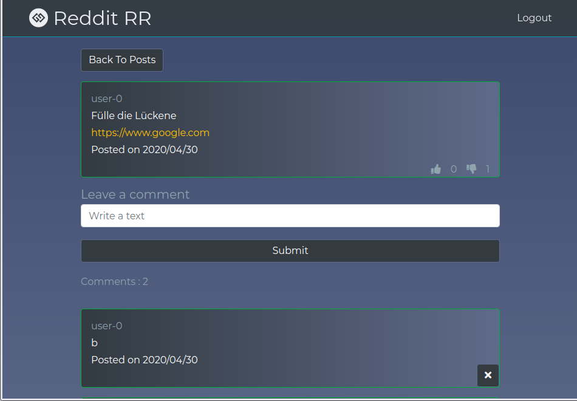

<h1 align="center">Welcome to Reddit_rr 👋</h1>

This project is a Reddit style app built by Ruby on Rails, React and Redux.<br />
The main feature is including link post, voting, comment, user sign-in.

##### Entity Relationship diagram


##### Server - all posts


##### Client




## Built With

- Ruby 2.6.3
- Rails 6.0
- PostgreSQL 10.10
- Sass
- [Acts as votable](https://github.com/ryanto/acts_as_votable/)
- [Faker](https://github.com/faker-ruby/faker)
- Webpacker 4.0
- React 16.12
- Redux 4.0

## Demo
not available

## Getting started

> Clone the repository to your local machine

```
$ git clone https://github.com/shjang7/reddit_rr.git
```

> Change directory into the directory

```
$ cd reddit_rr
```

> Create database

```
$ rails db:create
```

> Install dependencies:

```
$ bundle install
$ yarn install
$ cd client; npm install; cd ..
```

> Migrate database

```
$ rails db:migrate
```

> Seed sample data

```
$ rails db:seed
```

> Open server and Run client concurrently

```
$ npm run dev
```

> Go to `http://localhost:3000` using your browser.

## Author

👤 **Suhyeon Jang**

- Github: [@shjang7](https://github.com/shjang7)
- Linkedin: [@shjang](https://www.linkedin.com/in/shjang/)
- Twitter: [@shjang12](https://twitter.com/shjang12)

## 🤝 Contributing

Contributions, issues and feature requests are welcome!<br />Feel free to check [issues page](https://github.com/shjang7/reddit_rr/issues).

1. Fork it (https://github.com/shjang7/reddit_rr/fork)
2. Create your working branch (git checkout -b [choose-a-name])
3. Commit your changes (git commit -am 'what this commit will fix/add')
4. Push to the branch (git push origin feature/[feature-name])
5. Create a new Pull Request

## Show your support

Give a ⭐️ if you like this project!

## 📝 License

This project is [MIT](https://github.com/shjang7/reddit_rr/blob/master/LICENSE) licensed.
